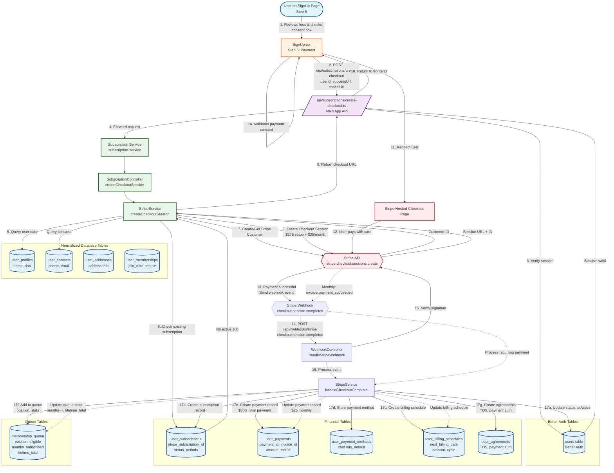

# Payment Flow Diagram

This diagram shows how payment data flows through the Tenure system from signup to Stripe and across different database tables.

## Payment Flow Summary

### Initial Payment Setup ($300)
1. **User initiates payment** on SignUp Step 5
2. **Frontend calls** `/api/subscriptions/create-checkout`
3. **Main app verifies** session in Better Auth `users` table
4. **Request forwarded** to Subscription Service
5. **Service queries** user data from `user_profiles` and `user_contacts`
6. **Service checks** for existing subscription in `user_subscriptions`
7. **Stripe Customer** created or retrieved via Stripe API
8. **Checkout Session** created with:
   - $275 one-time setup fee
   - $25/month recurring subscription
9. **User redirected** to Stripe Hosted Checkout
10. **User completes payment** with credit card

### Webhook Processing (After Payment)
11. **Stripe sends webhook** `checkout.session.completed`
12. **Webhook handler** verifies signature and processes event
13. **Multiple database updates** happen atomically:
    - `users` → status = 'Active'
    - `user_subscriptions` → Stripe subscription ID, periods, status
    - `user_billing_schedules` → next billing date ($25/month)
    - `user_payment_methods` → card info stored
    - `user_payments` → $300 initial payment record
    - `membership_queue` → user added with position, stats
    - `user_agreements` → TOS and payment authorization

### Recurring Payments ($25/month)
14. **Stripe auto-charges** monthly via saved payment method
15. **Webhook** `invoice.payment_succeeded` sent
16. **Service updates**:
    - `user_payments` → new $25 payment record
    - `membership_queue` → increment months_subscribed, update lifetime_total
    - `user_billing_schedules` → next billing date

## Key Database Tables

### Financial Tables
- **user_subscriptions**: Stripe subscription tracking (status, periods)
- **user_payments**: Payment history (initial $300, recurring $25)
- **user_payment_methods**: Stored card information
- **user_billing_schedules**: Next billing date and amount

### Queue Tables
- **membership_queue**: Position, eligibility, payment stats (months subscribed, lifetime total)

### User Tables
- **users** (Better Auth): Authentication and status
- **user_profiles**: Personal information
- **user_contacts**: Phone and email
- **user_addresses**: Physical address

### Compliance Tables
- **user_agreements**: TOS and payment authorization records

## Stripe Webhook Events Handled
1. `checkout.session.completed` → Initial payment + subscription setup
2. `invoice.payment_succeeded` → Recurring monthly payments
3. `customer.subscription.updated` → Subscription status changes
4. `customer.subscription.deleted` → Subscription cancellation (removes from queue)
5. `invoice.payment_failed` → Payment failure (logged)
